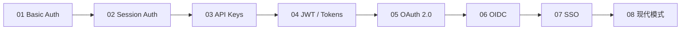

# Web Authentication 学习仓库

> 从最简单的 HTTP Basic Auth 到企业级 SSO，循序渐进地掌握 Web 认证的完整知识体系。

[](LICENSE)
[](#学习路径)

---

## 目录

- [项目简介](#项目简介)
- [学习路径](#学习路径)
- [仓库结构](#仓库结构)
- [快速开始](#快速开始)
- [Module 01 — Basic Authentication](#module-01--basic-authentication)
- [Module 02 — Session-based Authentication](#module-02--session-based-authentication)
- [Module 03 — API Keys](#module-03--api-keys)
- [Module 04 — JWT 与 Access/Refresh Token](#module-04--jwt-与-accessrefresh-token)
- [Module 05 — OAuth 2.0 / 2.1](#module-05--oauth-20--21)
- [Module 06 — OpenID Connect (OIDC)](#module-06--openid-connect-oidc)
- [Module 07 — SSO (SAML 2.0 & OIDC)](#module-07--sso-saml-20--oidc)
- [Module 08 — 现代认证模式](#module-08--现代认证模式)
- [测试工具链](#测试工具链)
- [推荐资源](#推荐资源)
- [学习进度](#学习进度)

---

## 项目简介

本仓库是一个 **渐进式、动手实践** 的 Web Authentication 学习项目。每个 Module 都是独立的，包含理论笔记、Node.js / Python 双语言实现、安全清单和一个 Mini-project。

认证机制可以分为三个概念层级：

| 层级 | 认证类型 | 核心思想 |
|------|---------|---------|
| **Credential-based（凭证型）** | Basic Auth, Session Auth | 直接传递或验证用户凭证 |
| **Stateless Token-based（无状态令牌型）** | API Keys, JWT, Access/Refresh Token | 服务端不存储会话状态，令牌自包含 |
| **Delegated/Federated（委托/联邦型）** | OAuth 2.0, OIDC, SSO | 委托第三方完成认证或授权 |

每个 Module 在前一个的基础上引入恰好一个新的认证机制，确保你在每一层都建立了扎实的理解。

---

## 学习路径



---

## 仓库结构

```
web-auth-learning/
├── README.md                        # 本文件
├── LICENSE
├── .github/
│   ├── ISSUE_TEMPLATE/
│   │   └── learning-task.md         # 用 Issue 作为学习任务
│   └── workflows/
│       └── ci.yml                   # GitHub Actions 验证示例代码
├── 01-basic-auth/
│   ├── README.md                    # 理论 + 安全笔记 + 练习
│   ├── node/                        # Node.js 实现
│   ├── python/                      # Python 实现
│   └── tests/
├── 02-session-auth/
│   ├── README.md
│   ├── node/
│   ├── python/
│   └── tests/
├── 03-api-keys/
│   ├── README.md
│   ├── node/
│   ├── python/
│   └── tests/
├── 04-jwt-auth/
│   ├── README.md
│   ├── node/
│   ├── python/
│   └── tests/
├── 05-oauth2/
│   ├── README.md
│   ├── node/
│   ├── python/
│   └── tests/
├── 06-openid-connect/
│   ├── README.md
│   ├── node/
│   ├── python/
│   └── tests/
├── 07-sso-saml-oidc/
│   ├── README.md
│   ├── node/
│   ├── python/
│   └── tests/
├── 08-modern-patterns/              # BFF, Passkeys, Zero Trust
│   ├── README.md
│   ├── node/
│   ├── python/
│   └── tests/
├── shared/                          # 可复用的工具、中间件
├── postman/                         # 每个 Module 的 Postman Collection
├── docker/                          # Keycloak, Redis 等 Docker Compose 文件
└── docs/
    ├── architecture.md              # 整体架构说明
    └── testing-guide.md             # 测试指南
```

---

## 快速开始

### 前置条件

- Node.js 20+ (通过 `nvm` 管理)
- Python 3.11+
- Docker & Docker Compose
- GitHub CLI (`gh`)

### 创建 Private Repository

```bash
# 使用 GitHub CLI 创建 private repo
gh repo create web-auth-learning --private --clone --description "Web Authentication 学习仓库：从 Basic Auth 到 SSO"

cd web-auth-learning

# 初始化项目
git init
cp /path/to/this/README.md .
mkdir -p {01-basic-auth,02-session-auth,03-api-keys,04-jwt-auth,05-oauth2,06-openid-connect,07-sso-saml-oidc,08-modern-patterns}/{node,python,tests}
mkdir -p shared postman docker docs .github/{ISSUE_TEMPLATE,workflows}

# 首次提交
git add .
git commit -m "init: 初始化 web authentication 学习仓库结构"
git push -u origin main
```

### 启动公共依赖

```bash
# 启动 Redis（Session 存储）和 Keycloak（SSO 模块）
cd docker
docker compose up -d redis keycloak
```

---

## Module 01 — Basic Authentication

### 核心概念

HTTP Basic Authentication 是最简单的认证方案，定义于 **RFC 7617**。客户端将 `username:password` 进行 Base64 编码后放入 `Authorization` Header 发送给服务端。

**请求流程：**

```
Client                              Server
  |                                    |
  |  GET /api/data                     |
  |  (无 Authorization Header)         |
  |----------------------------------->|
  |                                    |
  |  401 Unauthorized                  |
  |  WWW-Authenticate: Basic realm="x" |
  |<-----------------------------------|
  |                                    |
  |  GET /api/data                     |
  |  Authorization: Basic base64(u:p)  |
  |----------------------------------->|
  |                                    |
  |  200 OK + 数据                     |
  |<-----------------------------------|
```

### 关键要点

- Base64 只是**编码**，不是加密，任何人都可以解码
- **必须**配合 HTTPS/TLS 使用，否则凭证完全明文传输
- 浏览器会缓存 Basic Auth 凭证，**没有真正的 logout 机制**
- 没有 CSRF 防护
- 适用场景：Staging 环境门禁、VPN 后的内部工具、服务间通信

### 推荐 Libraries

| 语言 | Library | 说明 |
|------|---------|------|
| Node.js | `passport-http` | Passport.js 的 Basic Strategy |
| Node.js | `basic-auth` | 轻量级 Authorization Header 解析器 |
| Python | `requests.auth.HTTPBasicAuth` | requests 内置 Basic Auth 支持 |
| Python | `Flask-HTTPAuth` | Flask 装饰器模式，`@auth.verify_password` |

### Mini-project：Staging Gate API

构建一个简单的 Express.js API：

- `GET /health` — 公开端点
- `GET /admin` — Basic Auth 保护
- `GET /api/data` — Basic Auth 保护
- 密码使用 `bcrypt` 哈希存储
- 正确返回 `401` 和 `WWW-Authenticate` Header
- 强制 HTTPS

**测试命令：**

```bash
# 未认证
curl -i http://localhost:3000/api/data
# 期望: 401 Unauthorized

# 已认证
curl -u admin:secret https://localhost:3000/api/data
# 期望: 200 OK + JSON 数据
```

### 安全清单

- [ ] 密码使用 `bcrypt` 哈希存储（不是明文）
- [ ] 强制 HTTPS
- [ ] 正确返回 `WWW-Authenticate` Header
- [ ] 使用 `crypto.timingSafeEqual()` 做时间恒定比较，防止 Timing Attack

---

## Module 02 — Session-based Authentication

### 核心概念

Session Authentication 是**有状态**的认证方式。用户登录后，服务端创建一个 Session 并存储在服务器端（内存、Redis、数据库），然后通过 `Set-Cookie` 向客户端发送一个 Session ID。后续请求客户端自动携带这个 Cookie。

**与 Basic Auth 的关键区别：** 凭证只在登录时传输一次，之后靠 Session ID 维持认证状态。

### Cookie 安全属性（必须掌握）

| 属性 | 作用 | 设置 |
|------|------|------|
| `HttpOnly` | 阻止 JavaScript 访问 Cookie，防御 XSS | `true` |
| `Secure` | Cookie 仅通过 HTTPS 传输 | `true` |
| `SameSite` | 防御 CSRF 攻击 | `Lax`（推荐）或 `Strict` |
| `Max-Age` | Cookie 过期时间 | 根据业务设定 |

### 关键安全实践（OWASP 建议）

- 登录成功后**必须 regenerate Session ID**，防止 Session Fixation 攻击
- 实现 Idle Timeout（15–30 分钟无操作超时）和 Absolute Timeout（8–24 小时绝对超时）
- Logout 时**服务端销毁 Session**，不仅仅是删除客户端 Cookie
- 生产环境**绝对不要使用 In-Memory Session Store**（内存泄漏且无法水平扩展）

### 推荐 Libraries

| 语言 | Library | 说明 |
|------|---------|------|
| Node.js | `express-session` + `connect-redis` | Express Session 中间件 + Redis 存储 |
| Node.js | `passport-local` | Passport.js 的用户名密码策略 |
| Python | `Flask-Session` + Redis backend | Flask Session 扩展 |
| Python | `django.contrib.sessions` | Django 内置 Session 框架 |

### Mini-project：Secure Notes App

构建一个带用户注册/登录的笔记应用：

- 用户注册（密码用 `bcrypt` 哈希）
- 登录后创建 Session，设置安全 Cookie 属性
- 受保护的 CRUD 路由（创建/读取/更新/删除笔记）
- CSRF Token 防护
- 登录时 Session ID 重新生成
- Idle Timeout 自动登出
- Redis 作为 Session Store

### 安全清单

- [ ] Session ID 使用密码学安全的随机数生成
- [ ] 登录后 regenerate Session ID
- [ ] Cookie 设置 `HttpOnly`, `Secure`, `SameSite=Lax`
- [ ] 使用 Redis 而不是 In-Memory 存储 Session
- [ ] 实现 Idle Timeout 和 Absolute Timeout
- [ ] Logout 时服务端销毁 Session
- [ ] 实现 CSRF Token 保护

---

## Module 03 — API Keys

### 核心概念

API Key 用于标识**应用程序**而非用户。通常通过 HTTP Header（推荐 `x-api-key`）发送，**绝不要放在 Query Parameter 中**（会被记录到各种日志中）。

API Key 是 Developer API、服务间通信和用量追踪/计费的天然选择。

### 关键实践

- **生成必须用密码学安全方法：**
  - Node.js: `crypto.randomBytes(32).toString('hex')`
  - Python: `secrets.token_urlsafe(32)`
- 数据库中存储 API Key 的**哈希值**（像存密码一样）
- 生产环境用 AWS Secrets Manager 或 Parameter Store 管理
- 按照 NIST SP 800-53 建议每 **90 天**轮换一次
- 轮换期间支持多个活跃 Key（平滑过渡）

### 推荐 Libraries

API Key 通常不需要专门的 library，用自定义 middleware 即可实现。核心依赖：

| 语言 | 工具 | 用途 |
|------|------|------|
| Node.js | `crypto` (内置) | 生成安全随机 Key |
| Node.js | `express-rate-limit` | 速率限制 |
| Python | `secrets` (内置) | 生成安全随机 Key |
| Python | `slowapi` / `flask-limiter` | 速率限制 |

### Mini-project：Developer API Portal

- 用户注册后返回唯一 API Key
- API Key 哈希后存储在 SQLite
- `x-api-key` Header 中间件验证
- Per-Key 速率限制（100 requests/day）
- 用量追踪（带时间戳）
- Key 吊销和重新生成端点

### 安全清单

- [ ] API Key 使用密码学安全方式生成
- [ ] 数据库存储哈希值，不存原始 Key
- [ ] 仅通过 Header 传递，不用 Query Parameter
- [ ] 实现速率限制
- [ ] 支持 Key 吊销
- [ ] 记录每个 Key 的使用日志

---

## Module 04 — JWT 与 Access/Refresh Token

### 核心概念

JSON Web Token (RFC 7519) 由三部分组成，用 `.` 连接：

```
Header.Payload.Signature
```

- **Header**: 算法（`alg`）和类型（`typ`）
- **Payload**: Claims（如 `sub`, `exp`, `iss`, `aud`）
- **Signature**: 对 Header + Payload 的签名

JWT 是**无状态**的——任何拥有签名密钥的服务都可以独立验证 Token，非常适合微服务架构。

### Access Token + Refresh Token 模式

由于 JWT 是 stateless 的，**一旦签发就无法撤销**（在 TTL 到期前）。这就是 Access + Refresh Token rotation 模式存在的原因：

| Token 类型 | 生命周期 | 存储位置 | 用途 |
|-----------|---------|---------|------|
| Access Token | 短（5–15 分钟） | JavaScript 内存（SPA） | 访问受保护资源 |
| Refresh Token | 长（7–30 天） | `HttpOnly, Secure, SameSite` Cookie | 获取新的 Access Token |

**Refresh Token Rotation 与 Reuse Detection：** 每次使用 Refresh Token 获取新 Access Token 时，同时签发一个新的 Refresh Token 并使旧的失效。如果已被吊销的 Refresh Token 被再次使用（意味着被盗），则**整个 Token Family 必须全部吊销**。

### 推荐 Libraries（2026 年）

| 语言 | Library | 说明 |
|------|---------|------|
| Node.js | **`jose`** (v6.2.2, panva) | 零依赖，支持 Web Crypto API，跨运行时 — **新项目推荐** |
| Node.js | `jsonwebtoken` (v9.x) | 稳定但开发已放缓 |
| Python | **`PyJWT`** (v2.x) | FastAPI 推荐 |
| Python | **`joserfc`** | Authlib 作者开发，完整 JOSE 套件支持 |
| Python | ~~`python-jose`~~ | ⚠️ 自 2021 年起已不再维护，**应迁移到 `joserfc`** |

### 关键安全实践

- **始终 whitelist 允许的算法** — 永远不要信任 Token 中 `alg` Header 的声明
- **Algorithm Confusion 攻击：** 使用 RS256（非对称）的服务器如果也接受 HS256，攻击者可以用公钥当作 HMAC secret 来签名
- 生产环境使用**非对称算法**（`RS256` 或 `ES256`）分离签名密钥和验证密钥
- JWT Payload 是 Base64 **编码**而非加密，**绝不要在 Payload 中存放敏感数据**

### Mini-project：全栈笔记 API

- Express / FastAPI 后端，RS256 签名的 Access Token
- Refresh Token Rotation，存储在 `HttpOnly` Cookie
- Reuse Detection（Token Family 吊销）
- 通过 JWT Claims 实现 RBAC（Role-Based Access Control）
- React SPA 将 Access Token 存储在内存中
- Axios Interceptor 实现 Silent Refresh

### 安全清单

- [ ] 使用非对称算法（RS256 / ES256）
- [ ] Whitelist 允许的签名算法
- [ ] Access Token 生命周期 ≤ 15 分钟
- [ ] Refresh Token 存储在 HttpOnly Cookie
- [ ] 实现 Refresh Token Rotation
- [ ] 实现 Reuse Detection（Token Family 吊销）
- [ ] Payload 不含敏感信息

---

## Module 05 — OAuth 2.0 / 2.1

### 核心概念

OAuth 2.0 (RFC 6749) 是一个 **Authorization（授权）** 框架——它允许用户授权第三方应用在特定范围内访问其资源，而不需要分享密码。

**核心区分：OAuth 2.0 处理的是 Authorization（授权），而非 Authentication（认证）。**

### Grant Types（授权类型）

| Grant Type | 使用场景 | 状态 |
|-----------|---------|------|
| **Authorization Code + PKCE** | 交互式用户登录（Web/Mobile/SPA） | ✅ OAuth 2.1 中唯一推荐的用户流程 |
| **Client Credentials** | 机器对机器通信（M2M） | ✅ 无用户参与 |
| **Device Authorization** (RFC 8628) | 智能电视、IoT、CLI 等输入受限设备 | ✅ |
| ~~Implicit~~ | 已废弃 | ❌ OAuth 2.1 中移除 |
| ~~ROPC~~ | 已废弃 | ❌ OAuth 2.1 中移除 |

### Authorization Code + PKCE 流程

```
Client                   Authorization Server           Resource Server
  |                              |                             |
  | 1. 生成 code_verifier        |                             |
  |    计算 code_challenge       |                             |
  |    (SHA-256 哈希)            |                             |
  |                              |                             |
  | 2. /authorize?               |                             |
  |    response_type=code&       |                             |
  |    code_challenge=xxx&       |                             |
  |    code_challenge_method=S256|                             |
  |----------------------------->|                             |
  |                              |                             |
  | 3. 用户在 AuthZ Server 登录   |                             |
  |    并授权                     |                             |
  |                              |                             |
  | 4. redirect_uri?code=abc     |                             |
  |<-----------------------------|                             |
  |                              |                             |
  | 5. POST /token               |                             |
  |    code=abc&                 |                             |
  |    code_verifier=yyy         |                             |
  |----------------------------->|                             |
  |                              |                             |
  | 6. { access_token, ... }     |                             |
  |<-----------------------------|                             |
  |                              |                             |
  | 7. GET /resource             |                             |
  |    Authorization: Bearer xxx |                             |
  |----------------------------------------------------->     |
  |                              |                             |
  | 8. 200 OK + 数据              |                             |
  |<-----------------------------------------------------|    |
```

### OAuth 2.1 的 6 个关键变化

OAuth 2.1（IETF draft-15, 2026 年 3 月）将十年的安全最佳实践整合为一个规范：

1. **PKCE 对所有 Authorization Code 流程强制要求**（包括 Confidential Client）
2. **移除 Implicit Grant**
3. **移除 ROPC Grant**
4. **Redirect URI 必须精确匹配**（不再允许通配符）
5. **Bearer Token 不得出现在 Query String 中**
6. **Refresh Token 必须是 Sender-constrained 或 One-time Use**

### 推荐 Libraries

| 语言 | Library | 说明 |
|------|---------|------|
| Node.js | `passport` + `passport-google-oauth20` / `passport-github2` | "Login with X" 常见模式 |
| Node.js | `openid-client` (panva) | 底层 OIDC/OAuth 合规客户端 |
| Python | **`Authlib`** (v1.6.9) | 一站式解决 OAuth 1/2, OIDC, JOSE — **强烈推荐** |
| Python | `Requests-OAuthlib` | 简单客户端流程 |

### Mini-project：Multi-Provider Social Login Dashboard

- 实现 "Login with Google" 和 "Login with GitHub"
- 使用 Authorization Code + PKCE
- 正确验证 `state` 参数
- Redirect URI 精确匹配
- Token 存储在 `HttpOnly` Cookie
- 附加：使用 Device Authorization Flow 的 CLI 工具

### 安全清单

- [ ] 所有 Authorization Code 流程使用 PKCE
- [ ] 验证 `state` 参数防止 CSRF
- [ ] Redirect URI 精确匹配
- [ ] Token 不出现在 URL 或日志中
- [ ] Access Token 通过 `HttpOnly` Cookie 或 BFF 模式管理

---

## Module 06 — OpenID Connect (OIDC)

### 核心概念

**OIDC 不能脱离 OAuth 2.0 独立存在** — 它在 OAuth 2.0 Authorization 框架之上添加了一个 Authentication（认证）层。

关键补充：

| OIDC 新增概念 | 说明 |
|--------------|------|
| **ID Token** | 签名的 JWT，证明用户身份（包含 `sub`, `name`, `email` 等 Claims） |
| **UserInfo Endpoint** | 获取额外用户信息的标准端点 |
| **标准 Scopes** | `openid`, `profile`, `email`, `address`, `phone` |
| **Discovery Endpoint** | `/.well-known/openid-configuration` — 自动发现 Provider 配置 |

**核心区分：** OAuth 2.0 的 Access Token 回答"你能访问什么"（Authorization），而 OIDC 的 ID Token 回答"你是谁"（Authentication）。

### 推荐 Libraries

| 语言 | Library | 说明 |
|------|---------|------|
| Node.js | **`openid-client`** (panva) | OpenID Certified RP 客户端 — **金标准** |
| Node.js | `oidc-provider` (panva) | 构建自己的 OIDC Server（同样 OpenID Certified） |
| Node.js | `express-openid-connect` (Auth0) | Express 最小化集成封装 |
| Python | `mozilla-django-oidc` (v5.0.2+) | Django OIDC Authentication Backend |
| Python | `Authlib` | 同时支持 OIDC Client 和 Server |

### Mini-project：OIDC 认证应用

- 使用 Keycloak（Docker）作为 OIDC Provider
- 通过 `/.well-known/openid-configuration` 自动发现配置
- 实现 Authorization Code + PKCE 流程
- 解析和验证 ID Token
- 调用 UserInfo Endpoint 获取用户信息
- 展示 ID Token Claims 内容

### 安全清单

- [ ] 验证 ID Token 的签名（通过 JWKS）
- [ ] 验证 `iss`, `aud`, `exp`, `nonce` Claims
- [ ] 使用 HTTPS 访问 Discovery Endpoint
- [ ] 不依赖 ID Token 进行 API 授权（那是 Access Token 的工作）

---

## Module 07 — SSO (SAML 2.0 & OIDC)

### 核心概念

SSO（Single Sign-On）允许用户登录一次，即可访问多个应用。有两个主要协议：

| 对比维度 | SAML 2.0 | OIDC-based SSO |
|---------|----------|----------------|
| **数据格式** | XML Assertions | JSON Web Tokens |
| **移动端/SPA 支持** | 差（依赖 XML 解析和浏览器重定向） | 优秀（JSON + REST + PKCE） |
| **服务发现** | 手动交换 Metadata XML | 自动 `/.well-known` 发现 |
| **证书管理** | 手动轮换（经常导致故障） | 通过 JWKS 自动轮换 |
| **推荐场景** | 遗留企业系统、强监管行业 | 所有新开发项目 |

**选择原则：** 与遗留企业系统集成或客户强制要求时用 SAML，其他所有新开发都用 OIDC。大多数企业同时运行两者——Keycloak、Okta、Azure AD 都支持双协议。

### 推荐 Libraries

**SAML:**

| 语言 | Library | 说明 |
|------|---------|------|
| Node.js | `passport-saml` | 支持 `MultiSamlStrategy`（多租户） |
| Python | `python3-saml` | OneLogin 工具包，附带 Django/Flask 示例 |
| Python | `pysaml2` | 底层 SAML 控制 |

**OIDC:** 参考 Module 06 的 Libraries。

### 本地测试：Keycloak Docker 环境

```bash
docker run -p 8080:8080 \
  -e KC_BOOTSTRAP_ADMIN_USERNAME=admin \
  -e KC_BOOTSTRAP_ADMIN_PASSWORD=admin \
  quay.io/keycloak/keycloak:26.5.7 start-dev
```

管理控制台：`http://localhost:8080/admin`
OIDC Discovery：`http://localhost:8080/realms/{realm}/.well-known/openid-configuration`

**设置步骤：**
1. 创建 Realm
2. 创建用户
3. 创建 SAML Client（为 Node.js 应用）
4. 创建 OIDC Client（为 Python 应用）

### AWS 集成

AWS IAM Identity Center（前身 AWS SSO）支持与外部 IdP 进行 SAML 2.0 Federation。学习路径中可以包含一个附加练习：将 Keycloak 作为 IdP 与 AWS Sandbox 账户联邦。

**关键步骤：**
1. 配置 IdP 生成 SAML Metadata
2. 在 AWS IAM 中创建 SAML Identity Provider
3. 创建带 SAML Trust Policy 的 IAM Roles

### Mini-project：Enterprise SSO Gateway

- Keycloak（Docker）作为 Identity Provider
- Node.js 应用 — 通过 SAML（`passport-saml`）保护
- Python 应用 — 通过 OIDC（`Authlib` 或 `mozilla-django-oidc`）保护
- 两个应用都注册为 Keycloak Client
- 演示真正的 SSO：登录一个应用后访问另一个，自动完成认证
- 并排展示 SAML Assertion Attributes 与 OIDC ID Token Claims

### 安全清单

- [ ] SAML Assertion 验证签名
- [ ] 验证 Assertion 的 `Issuer`, `Audience`, `NotBefore/NotOnOrAfter`
- [ ] 防御 XML Signature Wrapping 攻击
- [ ] 正确处理 SAML Logout（SLO）
- [ ] OIDC 端遵循 Module 06 的所有安全清单

---

## Module 08 — 现代认证模式

### BFF Pattern（Backend for Frontend）

BFF 模式已成为 SPA 应用的**推荐标准架构**。核心思想：所有 Token 保留在服务端，浏览器只接收 `HttpOnly` Session Cookie。BFF 作为代理层转发 API 请求并附加 Access Token。

这从根本上消除了基于 XSS 的 Token 盗窃攻击。

```
Browser  <-->  BFF (Express)  <-->  API Server
         Cookie              Bearer Token
```

### Passkeys / WebAuthn

Passkeys 已达到临界规模：全球已生成超过 **10 亿个 Passkey**。Microsoft 在 2025 年 5 月将 Passkeys 设为所有新账户的默认方式，NIST SP 800-63-4（2025 年 7 月）承认可同步 Passkeys 为 **AAL2 合规**。

**推荐工具：**

| 工具 | 用途 |
|------|------|
| `@simplewebauthn/server` (Node.js) | WebAuthn Server 端实现 |
| `@simplewebauthn/browser` | WebAuthn 浏览器端 API 封装 |
| `py_webauthn` (Python) | Python WebAuthn 实现 |
| [webauthn.io](https://webauthn.io) | 交互式测试 Playground |

### Zero Trust

OWASP Zero Trust Architecture Cheat Sheet 正式确立了"永不信任，始终验证"原则。每个请求无论网络位置都必须经过认证。

**AWS 视角下的 Zero Trust 实践：**
- Cognito User Pools 签发 JWT
- API Gateway Authorizer 验证 Token
- 短生命周期 Token + 持续验证
- 防钓鱼 MFA（Phishing-resistant MFA）

---

## 测试工具链

每个 Module 都应包含 `postman/` 目录和 `curl` / `HTTPie` 命令示例。

| 工具 | 用途 | 说明 |
|------|------|------|
| **Postman** | API 测试 | 内置 OAuth 2.0 支持，用 Environment Variables 管理 Token |
| **curl / HTTPie** | 命令行测试 | `http -a user:pass GET localhost:3000/api`（HTTPie 语法更简洁） |
| **VS Code REST Client** | IDE 内测试 | `.http` 文件，支持 `{{$oidcAccessToken}}` 变量 |
| **jwt.io / jwt.ms** | Token 解码 | 解码和检查 JWT 内容（jwt.ms 对 Azure AD Token 特别有用） |
| **OWASP ZAP** | 安全扫描 | 自动化扫描各 Module 服务端的认证漏洞 |
| **Browser DevTools** | 调试 | Application Tab 查看 Cookie、Network Tab 追踪 OAuth Redirect 流程 |

---

## 推荐资源

### 规范与标准

- [RFC 7617 — HTTP Basic Authentication](https://datatracker.ietf.org/doc/html/rfc7617)
- [RFC 6749 — OAuth 2.0 Authorization Framework](https://datatracker.ietf.org/doc/html/rfc6749)
- [RFC 7519 — JSON Web Token (JWT)](https://datatracker.ietf.org/doc/html/rfc7519)
- [OpenID Connect Core 1.0](https://openid.net/specs/openid-connect-core-1_0.html)

### OWASP 安全指南

- [Authentication Cheat Sheet](https://cheatsheetseries.owasp.org/cheatsheets/Authentication_Cheat_Sheet.html)
- [Session Management Cheat Sheet](https://cheatsheetseries.owasp.org/cheatsheets/Session_Management_Cheat_Sheet.html)
- [JSON Web Token Cheat Sheet](https://cheatsheetseries.owasp.org/cheatsheets/JSON_Web_Token_for_Java_Cheat_Sheet.html)
- [Zero Trust Architecture Cheat Sheet](https://cheatsheetseries.owasp.org/cheatsheets/Zero_Trust_Architecture_Cheat_Sheet.html)

### 参考仓库

- [casdoor/awesome-auth](https://github.com/casdoor/awesome-auth) — 认证 Library 综合列表
- [alex996/node-auth](https://github.com/alex996/node-auth) — Node.js 认证渐进式学习
- [MDN Web Docs — HTTP Authentication](https://developer.mozilla.org/en-US/docs/Web/HTTP/Guides/Authentication)

### 交互工具

- [jwt.io](https://jwt.io) — JWT 解码器与调试器
- [webauthn.io](https://webauthn.io) — WebAuthn/Passkey 测试
- [OAuth 2.0 Playground (Google)](https://developers.google.com/oauthplayground) — OAuth 流程实验

---

## 学习进度

- [ ] **Module 01** — Basic Authentication
- [ ] **Module 02** — Session-based Authentication
- [ ] **Module 03** — API Keys
- [ ] **Module 04** — JWT 与 Access/Refresh Token
- [ ] **Module 05** — OAuth 2.0 / 2.1
- [ ] **Module 06** — OpenID Connect (OIDC)
- [ ] **Module 07** — SSO (SAML 2.0 & OIDC)
- [ ] **Module 08** — 现代认证模式 (BFF, Passkeys, Zero Trust)

---

## License

MIT
